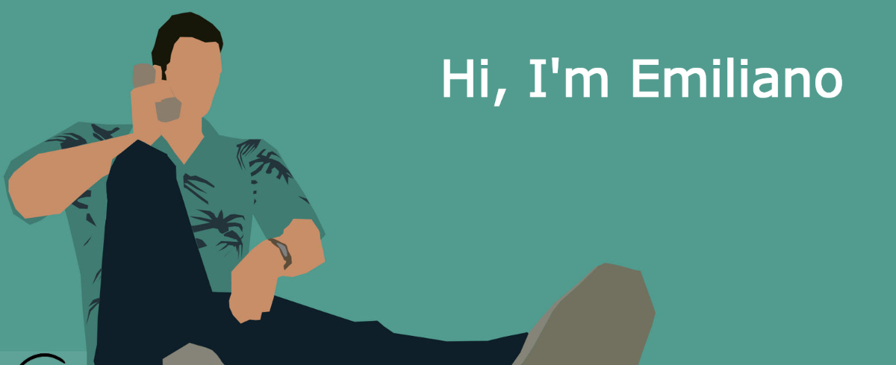

# Who I am?

    My name is Emiliano and I'm a Front End Developer who
    loves the JavaScript technologies. Right now I'm focused on learning
    everything that is related to Web Development. I'm also passionate about exploring new technologies.

# Technologies & Tools (W.I.P)

<table>
  <tr>
    <td align="center" height="108" width="108">
      
       <strong>HTML5</strong>
    </td>
    <td align="center" height="108" width="108">
      
       <strong>CSS3</strong>
    </td>
    <td align="center" height="108" width="108">
      
       <strong>JavaScript</strong>
    </td>
    <td align="center" height="108" width="108">
      
       <strong>Bootstrap</strong>
    </td>
  </tr>
  <tr>
    <td align="center" height="108" width="108">
      
       <strong>Git</strong>
    </td>
    <td align="center" height="108" width="108">
      
       <strong>Npm</strong>
    </td>
    <td align="center" height="108" width="108">
      
       <strong>SASS</strong>
    </td>
  </tr>
</table>
